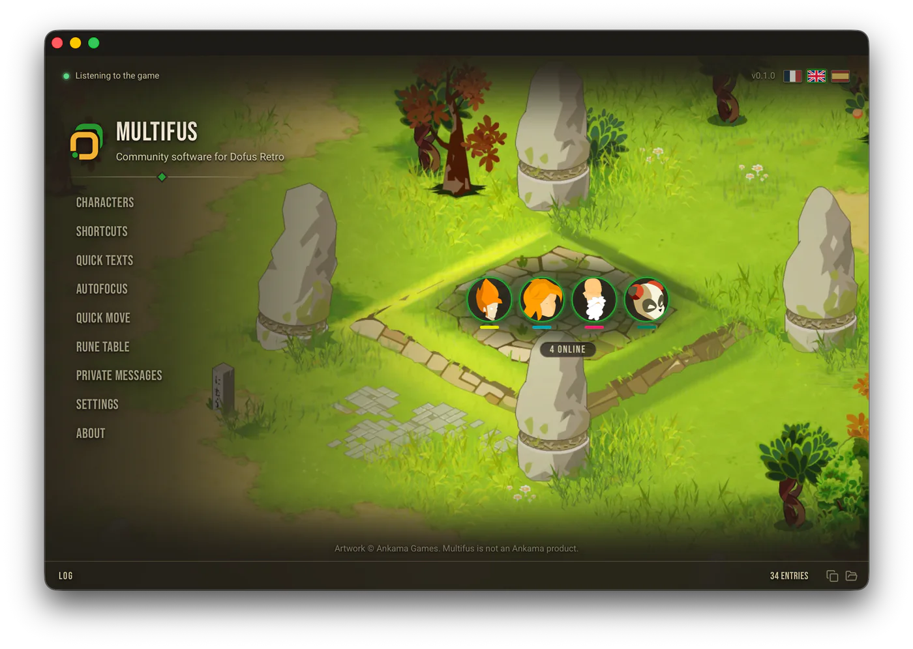

# Multifus

A multi-account window manager for Dofus Retro, on macOS and Windows. The window
of the character whose turn it is comes to the front on its own. Free, no
account, no ads, and [within Ankama's rules](https://www.multifus.app/en/ankama).

## Download

### macOS

macOS 13.3 or later, on Intel and Apple Silicon. Signed and notarized by Apple.

[Download for Mac](https://www.multifus.app/en/download)

### Windows

Windows 10 or 11. Windows may warn about a new app: click **More info**, then
**Run anyway**.

[Download for Windows](https://www.multifus.app/en/download)

Multifus updates itself. What each version changed is in the
[changelog](https://www.multifus.app/en/changelog).

## Features

- [AutoFocus](https://www.multifus.app/en/autofocus): the window of the
  character whose turn it is comes forward as the turn starts, and on a trade,
  an invitation or a private message.
- [Character wheel](https://www.multifus.app/en/character-wheel): hold a
  shortcut, aim at a class head, let go.
- [Quick move](https://www.multifus.app/en/quick-move): click where you want to
  go, and the next character lands in front of you.
- [Rune table](https://www.multifus.app/en/rune-table): the rune weight table
  lies over the game window.
- [Private messages](https://www.multifus.app/en/private-messages): your private
  messages reach your phone through Telegram.
- [Quick texts](https://www.multifus.app/en/quick-texts): a key combination
  writes your sentence in the chat field.

Found a bug? [Open an issue](https://github.com/viclafouch/multifus/issues), in
French, English or Spanish.

## Architecture

A pnpm workspace driven by Turborepo.

```
apps/
  desktop/    Tauri application, React and TypeScript front end, Rust back end
  website/    TanStack Start website, prerendered and served by Vercel
packages/
  ankama/     Ankama artwork, excluded from the MIT licence
  retro/      Shared styles and components
  runes/      Rune weights from the game
```

## Requirements

- [Node](https://nodejs.org) 24
- [pnpm](https://pnpm.io/installation) 12, or `corepack enable`
- [Rust](https://www.rust-lang.org/tools/install) stable, for `apps/desktop`
- The [Tauri prerequisites](https://tauri.app/start/prerequisites/) of your system

## Getting started

```sh
pnpm install    # also installs the git hook that replays the CI checks
pnpm dev:app    # runs the desktop application
pnpm dev:site   # runs the website
pnpm check      # formatting, lints and tests, both languages, every workspace
```

## Licence

[MIT](./LICENSE), except `packages/ankama`, which holds artwork owned by Ankama.

Dofus and Dofus Retro are trademarks of Ankama. This project is not affiliated
with them.
